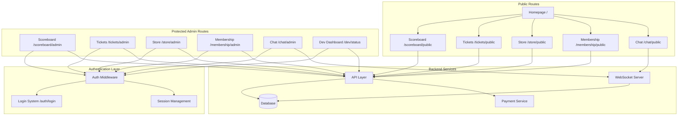

# System Separation and Authentication Design Document

## Overview

This design transforms the current unified basketball platform into a professionally separated multi-system architecture with role-based access control. The platform will feature five distinct systems, each with public-facing interfaces for end users and protected administrative interfaces for system management. A comprehensive authentication system will secure all administrative functions, while a developer dashboard will provide system-wide monitoring capabilities.

## Architecture

### High-Level System Architecture



### Route Structure Design

```
/                           # Public homepage with system navigation
├── auth/
│   ├── login              # Authentication login page
│   ├── logout             # Logout endpoint
│   └── session            # Session validation
├── scoreboard/
│   ├── public             # Read-only scoreboard for fans
│   └── admin              # Game management interface
├── tickets/
│   ├── public             # Ticket browsing and purchasing
│   └── admin              # Ticket management and analytics
├── store/
│   ├── public             # Product catalog and shopping
│   └── admin              # Product and order management
├── membership/
│   ├── public             # Membership tiers and signup
│   └── admin              # Member management and analytics
├── chat/
│   ├── public             # Live game chat interface
│   └── admin              # Chat moderation and management
└── dev/
    └── status             # Developer system dashboard
```

## Components and Interfaces

### Authentication System

#### Session Management
```typescript
interface UserSession {
  id: string;
  email: string;
  role: 'admin' | 'developer';
  permissions: string[];
  createdAt: Date;
  expiresAt: Date;
  lastActivity: Date;
}

interface AuthConfig {
  sessionTimeout: number; // 8 hours default
  maxConcurrentSessions: number;
  requireMFA: boolean;
  passwordPolicy: PasswordPolicy;
}
```

#### Authentication Middleware
```typescript
interface AuthMiddleware {
  validateSession(request: Request): Promise<UserSession | null>;
  requireAuth(permissions?: string[]): Middleware;
  refreshSession(sessionId: string): Promise<UserSession>;
  logout(sessionId: string): Promise<void>;
}
```

### System Interfaces

#### Scoreboard System
```typescript
interface ScoreboardPublic {
  getCurrentGame(): Promise<GameDisplay>;
  getGameHistory(): Promise<GameSummary[]>;
  subscribeToUpdates(): WebSocketConnection;
}

interface ScoreboardAdmin extends ScoreboardPublic {
  createGame(gameData: GameCreation): Promise<Game>;
  updateScore(gameId: string, scoreUpdate: ScoreUpdate): Promise<Game>;
  manageGame(gameId: string, action: GameAction): Promise<Game>;
  getGameAnalytics(): Promise<GameAnalytics>;
}
```

#### Ticketing System
```typescript
interface TicketingPublic {
  getAvailableTickets(): Promise<TicketListing[]>;
  purchaseTickets(purchase: TicketPurchase): Promise<PurchaseConfirmation>;
  getTicketDetails(ticketId: string): Promise<TicketDetails>;
}

interface TicketingAdmin extends TicketingPublic {
  createTicketType(ticketType: TicketTypeCreation): Promise<TicketType>;
  manageInventory(updates: InventoryUpdate[]): Promise<void>;
  processRefunds(refundRequest: RefundRequest): Promise<RefundResult>;
  getTicketAnalytics(): Promise<TicketAnalytics>;
}
```

#### E-commerce System
```typescript
interface StorePublic {
  getProducts(filters?: ProductFilters): Promise<Product[]>;
  getCart(sessionId: string): Promise<Cart>;
  addToCart(sessionId: string, item: CartItem): Promise<Cart>;
  checkout(sessionId: string, payment: PaymentInfo): Promise<OrderConfirmation>;
}

interface StoreAdmin extends StorePublic {
  createProduct(product: ProductCreation): Promise<Product>;
  updateInventory(updates: InventoryUpdate[]): Promise<void>;
  processOrders(orders: OrderProcessing[]): Promise<void>;
  getStoreAnalytics(): Promise<StoreAnalytics>;
}
```

#### Membership System
```typescript
interface MembershipPublic {
  getMembershipTiers(): Promise<MembershipTier[]>;
  purchaseMembership(purchase: MembershipPurchase): Promise<MembershipConfirmation>;
  getMemberBenefits(memberId: string): Promise<MemberBenefits>;
}

interface MembershipAdmin extends MembershipPublic {
  createMembershipTier(tier: TierCreation): Promise<MembershipTier>;
  manageMember(memberId: string, action: MemberAction): Promise<Member>;
  processPayments(payments: PaymentProcessing[]): Promise<void>;
  getMemberAnalytics(): Promise<MemberAnalytics>;
}
```

#### Chat System
```typescript
interface ChatPublic {
  joinChat(userId: string, gameId: string): Promise<ChatSession>;
  sendMessage(sessionId: string, message: ChatMessage): Promise<void>;
  subscribeToMessages(): WebSocketConnection;
}

interface ChatAdmin extends ChatPublic {
  moderateMessage(messageId: string, action: ModerationAction): Promise<void>;
  manageUser(userId: string, action: UserAction): Promise<void>;
  getChatAnalytics(): Promise<ChatAnalytics>;
  exportChatHistory(filters: ChatFilters): Promise<ChatExport>;
}
```

## Data Models

### Authentication Models
```typescript
interface User {
  id: string;
  email: string;
  passwordHash: string;
  role: 'admin' | 'developer';
  permissions: Permission[];
  createdAt: Date;
  lastLogin: Date;
  isActive: boolean;
}

interface Session {
  id: string;
  userId: string;
  token: string;
  createdAt: Date;
  expiresAt: Date;
  lastActivity: Date;
  ipAddress: string;
  userAgent: string;
}
```

### Enhanced System Models
```typescript
interface Game {
  id: string;
  homeTeam: string;
  awayTeam: string;
  homeScore: number;
  awayScore: number;
  status: 'scheduled' | 'live' | 'finished' | 'cancelled';
  startTime: Date;
  venue: string;
  createdBy: string;
  updatedAt: Date;
}

interface TicketType {
  id: string;
  gameId: string;
  name: string;
  price: number;
  totalQuantity: number;
  availableQuantity: number;
  seatSection: string;
  benefits: string[];
  isActive: boolean;
}

interface MembershipTier {
  id: string;
  name: 'Bronze' | 'Silver' | 'Gold';
  price: number;
  duration: number; // months
  benefits: MembershipBenefit[];
  isActive: boolean;
  maxMembers?: number;
}

interface Member {
  id: string;
  email: string;
  tierName: string;
  purchaseDate: Date;
  expiryDate: Date;
  paymentStatus: 'active' | 'expired' | 'cancelled';
  benefits: MembershipBenefit[];
}

interface Order {
  id: string;
  customerId: string;
  items: OrderItem[];
  totalAmount: number;
  status: 'pending' | 'paid' | 'shipped' | 'delivered' | 'cancelled';
  paymentId: string;
  shippingAddress: Address;
  createdAt: Date;
}
```

### Payment Integration Models
```typescript
interface Payment {
  id: string;
  orderId: string;
  amount: number;
  currency: string;
  method: 'card' | 'paypal' | 'bank_transfer';
  status: 'pending' | 'completed' | 'failed' | 'refunded';
  transactionId: string;
  processedAt: Date;
}

interface PaymentProvider {
  processPayment(payment: PaymentRequest): Promise<PaymentResult>;
  refundPayment(paymentId: string, amount?: number): Promise<RefundResult>;
  getPaymentStatus(paymentId: string): Promise<PaymentStatus>;
}
```

## Error Handling

### Authentication Errors
```typescript
enum AuthError {
  INVALID_CREDENTIALS = 'INVALID_CREDENTIALS',
  SESSION_EXPIRED = 'SESSION_EXPIRED',
  INSUFFICIENT_PERMISSIONS = 'INSUFFICIENT_PERMISSIONS',
  ACCOUNT_LOCKED = 'ACCOUNT_LOCKED',
  MFA_REQUIRED = 'MFA_REQUIRED'
}

interface AuthErrorResponse {
  error: AuthError;
  message: string;
  redirectUrl?: string;
  retryAfter?: number;
}
```

### System-Specific Error Handling
```typescript
interface SystemError {
  code: string;
  message: string;
  system: 'scoreboard' | 'tickets' | 'store' | 'membership' | 'chat';
  severity: 'low' | 'medium' | 'high' | 'critical';
  timestamp: Date;
  userId?: string;
  context?: Record<string, any>;
}

interface ErrorHandler {
  logError(error: SystemError): Promise<void>;
  notifyAdmins(error: SystemError): Promise<void>;
  getErrorMetrics(): Promise<ErrorMetrics>;
}
```

## Testing Strategy

### Authentication Testing
```typescript
describe('Authentication System', () => {
  test('should authenticate valid credentials');
  test('should reject invalid credentials');
  test('should handle session expiration');
  test('should enforce permission requirements');
  test('should prevent concurrent session abuse');
});
```

### System Separation Testing
```typescript
describe('System Route Separation', () => {
  test('public routes should be accessible without auth');
  test('admin routes should require authentication');
  test('admin routes should enforce proper permissions');
  test('system data should be properly isolated');
  test('cross-system operations should work correctly');
});
```

### Integration Testing
```typescript
describe('Payment Integration', () => {
  test('should process ticket purchases');
  test('should handle membership payments');
  test('should process store orders');
  test('should handle payment failures gracefully');
  test('should process refunds correctly');
});
```

### Performance Testing
```typescript
describe('System Performance', () => {
  test('should handle concurrent admin sessions');
  test('should maintain real-time updates under load');
  test('should process payments within acceptable time');
  test('should handle database queries efficiently');
});
```

## Security Considerations

### Authentication Security
- **Password Security**: Bcrypt hashing with salt rounds ≥ 12
- **Session Security**: Secure HTTP-only cookies with CSRF protection
- **Rate Limiting**: Login attempt limiting (5 attempts per 15 minutes)
- **Session Timeout**: Automatic logout after 8 hours of inactivity

### API Security
- **Input Validation**: Zod schema validation on all endpoints
- **SQL Injection Prevention**: Parameterized queries via Prisma ORM
- **XSS Protection**: Content Security Policy headers
- **CORS Configuration**: Restricted origins for production

### Payment Security
- **PCI Compliance**: No card data storage, tokenized payments only
- **Encryption**: TLS 1.3 for all payment communications
- **Audit Logging**: Complete payment transaction logging
- **Fraud Detection**: Basic fraud prevention measures

## Performance Optimization

### Caching Strategy
```typescript
interface CacheStrategy {
  publicData: {
    scoreboard: '30 seconds',
    products: '5 minutes',
    membershipTiers: '1 hour'
  };
  adminData: {
    analytics: '5 minutes',
    userSessions: '1 minute',
    systemMetrics: '30 seconds'
  };
}
```

### Database Optimization
- **Indexing**: Strategic indexes on frequently queried fields
- **Connection Pooling**: Optimized connection pool configuration
- **Query Optimization**: Efficient joins and data fetching
- **Data Archiving**: Historical data archiving strategy

### Real-time Performance
- **WebSocket Optimization**: Connection pooling and message batching
- **Event Broadcasting**: Efficient real-time update distribution
- **Load Balancing**: WebSocket server scaling strategy

## Deployment Architecture

### Environment Configuration
```typescript
interface DeploymentConfig {
  development: {
    database: 'local PostgreSQL',
    authentication: 'simple credentials',
    payments: 'sandbox mode',
    realtime: 'single server'
  };
  production: {
    database: 'managed PostgreSQL with replicas',
    authentication: 'secure sessions with MFA',
    payments: 'live payment processing',
    realtime: 'clustered WebSocket servers'
  };
}
```

### Monitoring and Observability
- **Health Checks**: System health endpoints for all services
- **Metrics Collection**: Performance and usage metrics
- **Error Tracking**: Comprehensive error logging and alerting
- **Audit Logging**: Complete audit trail for administrative actions

This design provides a robust, scalable, and secure foundation for the separated basketball platform systems with proper authentication, payment processing, and administrative controls.