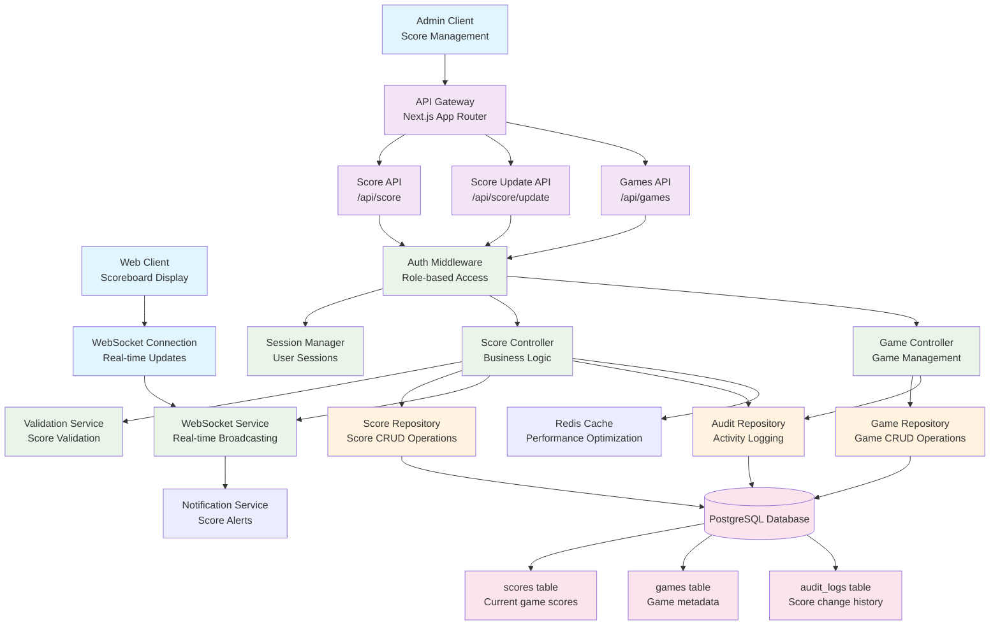

# Basketball Scoreboard System - Component Architecture

## System Overview
Real-time basketball scoreboard with live updates, game management, and audit logging.

## Component Diagram

## Key Backend Principles Demonstrated

### 1. **Separation of Concerns**
- Clear separation between API routes, business logic, and data access
- Dedicated controllers for different domains (Score vs Game management)

### 2. **Real-time Architecture**
- WebSocket integration for live score updates
- Event-driven architecture with broadcasting capabilities

### 3. **Security & Authentication**
- Role-based access control for score updates
- Session management with audit trails

### 4. **Data Consistency**
- Validation services to ensure score integrity
- Audit logging for all score changes
- ACID transactions for score updates

### 5. **Performance Optimization**
- Redis caching for frequently accessed scores
- Efficient database queries with proper indexing

### 6. **Scalability Considerations**
- Stateless API design
- Event-driven real-time updates
- Horizontal scaling capability through load balancing

## Data Models

- **Score**: Current game state (teamA, teamB scores)
- **Game**: Game metadata (teams, status, timing)
- **AuditLog**: Complete history of score changes
- **Session**: User authentication and authorization

## API Endpoints

- `GET /api/score` - Retrieve current scores
- `POST /api/score/update` - Update game scores (Admin only)
- `GET /api/games` - List all games
- `POST /api/games` - Create new game (Admin only)
- `WebSocket /ws/scores` - Real-time score updates
