# E-commerce Store System - Component Architecture

## System Overview
Full-featured e-commerce platform with inventory management, shopping cart, order processing, and payment integration.

## Component Diagram

```mermaid
graph TB
    %% Client Layer
    WebStore[Web Store<br/>Customer Shopping]
    MobileApp[Mobile App<br/>Shopping Experience]
    AdminDashboard[Admin Dashboard<br/>Store Management]
    InventoryPanel[Inventory Panel<br/>Stock Management]
    
    %% API Gateway Layer
    APIGateway[API Gateway<br/>Next.js App Router]
    LoadBalancer[Load Balancer<br/>Traffic Distribution]
    
    %% API Routes
    ProductsAPI[Products API<br/>/api/products]
    CartAPI[Cart API<br/>/api/cart]
    OrdersAPI[Orders API<br/>/api/orders]
    InventoryAPI[Inventory API<br/>/api/inventory]
    PaymentAPI[Payment API<br/>/api/payments]
    
    %% Business Logic Layer
    ProductService[Product Service<br/>Catalog Management]
    CartService[Cart Service<br/>Shopping Cart Logic]
    OrderService[Order Service<br/>Order Processing]
    InventoryService[Inventory Service<br/>Stock Management]
    PaymentService[Payment Service<br/>Payment Processing]
    
    %% Domain Services
    CatalogManager[Catalog Manager<br/>Product Organization]
    PricingEngine[Pricing Engine<br/>Dynamic Pricing]
    InventoryManager[Inventory Manager<br/>Stock Control]
    OrderProcessor[Order Processor<br/>Order Fulfillment]
    PaymentProcessor[Payment Processor<br/>Transaction Handling]
    
    %% Supporting Services
    ValidationService[Validation Service<br/>Data Validation]
    NotificationService[Notification Service<br/>Order Alerts]
    SearchEngine[Search Engine<br/>Product Discovery]
    RecommendationEngine[Recommendation Engine<br/>Product Suggestions]
    
    %% Authentication & Authorization
    AuthService[Auth Service<br/>Customer Authentication]
    AdminAuth[Admin Auth<br/>Staff Authentication]
    SessionManager[Session Manager<br/>User Sessions]
    
    %% Data Access Layer
    ProductRepository[Product Repository<br/>Product CRUD]
    CartRepository[Cart Repository<br/>Cart CRUD]
    OrderRepository[Order Repository<br/>Order CRUD]
    InventoryRepository[Inventory Repository<br/>Inventory CRUD]
    PaymentRepository[Payment Repository<br/>Payment CRUD]
    AuditRepository[Audit Repository<br/>Activity Logs]
    
    %% Database Layer
    PostgreSQL[(PostgreSQL Database)]
    ProductTable[products table<br/>Product catalog]
    CartTable[cart_items table<br/>Shopping cart items]
    OrderTable[orders table<br/>Order records]
    OrderItemTable[order_items table<br/>Order line items]
    PaymentTable[payments table<br/>Payment records]
    InventoryTable[inventory table<br/>Stock levels]
    
    %% External Services
    PaymentGateway[Payment Gateway<br/>Stripe/PayPal/Square]
    ShippingAPI[Shipping API<br/>UPS/FedEx/USPS]
    TaxService[Tax Service<br/>Tax Calculation]
    EmailService[Email Service<br/>Order Confirmations]
    CDNService[CDN Service<br/>Product Images]
    
    %% Caching & Performance
    RedisCache[Redis Cache<br/>Session & Cart Data]
    SearchIndex[Search Index<br/>Elasticsearch]
    ImageStorage[Image Storage<br/>Product Photos]
    
    %% Background Services
    JobQueue[Job Queue<br/>Async Processing]
    InventoryWorker[Inventory Worker<br/>Stock Updates]
    OrderWorker[Order Worker<br/>Order Processing]
    EmailWorker[Email Worker<br/>Notifications]
    AnalyticsWorker[Analytics Worker<br/>Sales Reporting]
    
    %% Data Flow Connections
    WebStore --> LoadBalancer
    MobileApp --> LoadBalancer
    AdminDashboard --> LoadBalancer
    InventoryPanel --> LoadBalancer
    
    LoadBalancer --> APIGateway
    
    APIGateway --> ProductsAPI
    APIGateway --> CartAPI
    APIGateway --> OrdersAPI
    APIGateway --> InventoryAPI
    APIGateway --> PaymentAPI
    
    ProductsAPI --> AuthService
    CartAPI --> AuthService
    OrdersAPI --> AuthService
    InventoryAPI --> AdminAuth
    PaymentAPI --> AuthService
    
    AuthService --> SessionManager
    AdminAuth --> SessionManager
    
    ProductsAPI --> ProductService
    CartAPI --> CartService
    OrdersAPI --> OrderService
    InventoryAPI --> InventoryService
    PaymentAPI --> PaymentService
    
    ProductService --> CatalogManager
    ProductService --> PricingEngine
    ProductService --> SearchEngine
    ProductService --> RecommendationEngine
    
    CartService --> InventoryManager
    CartService --> PricingEngine
    CartService --> ValidationService
    
    OrderService --> OrderProcessor
    OrderService --> PaymentProcessor
    OrderService --> InventoryManager
    OrderService --> NotificationService
    
    InventoryService --> InventoryManager
    PaymentService --> PaymentProcessor
    
    ProductService --> ProductRepository
    CartService --> CartRepository
    OrderService --> OrderRepository
    InventoryService --> InventoryRepository
    PaymentService --> PaymentRepository
    
    ProductRepository --> PostgreSQL
    CartRepository --> PostgreSQL
    OrderRepository --> PostgreSQL
    InventoryRepository --> PostgreSQL
    PaymentRepository --> PostgreSQL
    AuditRepository --> PostgreSQL
    
    PostgreSQL --> ProductTable
    PostgreSQL --> CartTable
    PostgreSQL --> OrderTable
    PostgreSQL --> OrderItemTable
    PostgreSQL --> PaymentTable
    PostgreSQL --> InventoryTable
    
    PaymentProcessor --> PaymentGateway
    OrderProcessor --> ShippingAPI
    OrderProcessor --> TaxService
    NotificationService --> EmailService
    ProductService --> CDNService
    
    CartService --> RedisCache
    SessionManager --> RedisCache
    SearchEngine --> SearchIndex
    ProductService --> ImageStorage
    
    OrderService --> JobQueue
    InventoryService --> JobQueue
    PaymentService --> JobQueue
    
    JobQueue --> InventoryWorker
    JobQueue --> OrderWorker
    JobQueue --> EmailWorker
    JobQueue --> AnalyticsWorker
    
    InventoryWorker --> InventoryManager
    OrderWorker --> OrderProcessor
    EmailWorker --> EmailService
    AnalyticsWorker --> AuditRepository
    
    %% Styling
    classDef clientLayer fill:#e1f5fe
    classDef apiLayer fill:#f3e5f5
    classDef businessLayer fill:#e8f5e8
    classDef domainLayer fill:#e0f2f1
    classDef supportLayer fill:#fce4ec
    classDef dataLayer fill:#fff3e0
    classDef databaseLayer fill:#fce4ec
    classDef externalLayer fill:#f1f8e9
    classDef backgroundLayer fill:#fff9c4
    
    class WebStore,MobileApp,AdminDashboard,InventoryPanel clientLayer
    class APIGateway,LoadBalancer,ProductsAPI,CartAPI,OrdersAPI,InventoryAPI,PaymentAPI apiLayer
    class ProductService,CartService,OrderService,InventoryService,PaymentService businessLayer
    class CatalogManager,PricingEngine,InventoryManager,OrderProcessor,PaymentProcessor domainLayer
    class ValidationService,NotificationService,SearchEngine,RecommendationEngine,AuthService,AdminAuth,SessionManager supportLayer
    class ProductRepository,CartRepository,OrderRepository,InventoryRepository,PaymentRepository,AuditRepository dataLayer
    class PostgreSQL,ProductTable,CartTable,OrderTable,OrderItemTable,PaymentTable,InventoryTable databaseLayer
    class PaymentGateway,ShippingAPI,TaxService,EmailService,CDNService,RedisCache,SearchIndex,ImageStorage externalLayer
    class JobQueue,InventoryWorker,OrderWorker,EmailWorker,AnalyticsWorker backgroundLayer
```

## Key Backend Principles Demonstrated

### 1. **Domain-Driven Design (DDD)**
- Clear domain separation (Product, Cart, Order, Inventory, Payment)
- Rich domain services with complex business logic
- Aggregate patterns for transaction consistency

### 2. **Event-Driven Commerce**
- Asynchronous order processing with job queues
- Inventory updates triggered by order events
- Real-time notifications for order status changes

### 3. **Financial Transaction Integrity**
- ACID compliance for payment processing
- Comprehensive audit trails for financial operations
- Integration with multiple payment gateways

### 4. **Inventory Management**
- Real-time stock level tracking
- Concurrent order handling with stock reservation
- Automated low-stock alerts and reordering

### 5. **Performance & Scalability**
- Redis caching for shopping carts and sessions
- Elasticsearch for fast product search
- CDN integration for product image delivery
- Horizontal scaling through load balancing

### 6. **Security & Compliance**
- PCI DSS compliance considerations
- Role-based access for admin functions
- Secure session management and authentication

## Data Models

- **Product**: Complete product catalog with variants and pricing
- **CartItem**: Shopping cart line items with quantities
- **Order**: Customer orders with shipping and billing information
- **OrderItem**: Individual order line items with pricing snapshots
- **Payment**: Payment transactions with status tracking
- **Inventory**: Real-time stock levels and locations

## API Endpoints

- `GET /api/products` - Browse product catalog
- `POST /api/products` - Add new products (Admin)
- `GET /api/cart` - View shopping cart
- `POST /api/cart/add` - Add items to cart
- `POST /api/orders` - Place order
- `GET /api/orders` - Order history
- `POST /api/payments` - Process payment

## Business Processes

### Order Fulfillment Flow
1. Cart validation and inventory check
2. Tax and shipping calculation
3. Payment processing
4. Inventory reservation
5. Order confirmation
6. Shipping label generation
7. Fulfillment tracking

### Inventory Management
- Real-time stock updates
- Low stock alerts
- Automatic reordering
- Multi-location inventory tracking

## Background Jobs

- **Inventory Worker**: Stock level updates and alerts
- **Order Worker**: Order processing and fulfillment
- **Email Worker**: Customer notifications and confirmations
- **Analytics Worker**: Sales reporting and business intelligence
