# Live Stream with Chat System - Component Architecture

## System Overview
Real-time live streaming platform with integrated chat, moderation, and user management capabilities.

## Component Diagram

```mermaid
graph TB
    %% Client Layer
    StreamViewer[Stream Viewer<br/>Video Player + Chat]
    MobileBrowser[Mobile Browser<br/>Responsive Viewer]
    AdminConsole[Admin Console<br/>Stream Management]
    ModeratorPanel[Moderator Panel<br/>Chat Moderation]
    
    %% CDN & Media Layer
    CDN[CDN<br/>Video Delivery Network]
    VideoPlayer[Video Player<br/>YouTube Embed]
    
    %% API Gateway Layer
    APIGateway[API Gateway<br/>Next.js App Router]
    WebSocketGateway[WebSocket Gateway<br/>Real-time Communication]
    
    %% API Routes
    StreamAPI[Stream API<br/>/api/livestream]
    ChatAPI[Chat API<br/>/api/messages]
    ModerationAPI[Moderation API<br/>/api/chat/moderation]
    UsersAPI[Users API<br/>/api/chat/users]
    
    %% Real-time Services
    WebSocketManager[WebSocket Manager<br/>Connection Management]
    ChatService[Chat Service<br/>Message Processing]
    ModerationService[Moderation Service<br/>Content Filtering]
    PresenceService[Presence Service<br/>User Activity Tracking]
    
    %% Business Logic Layer
    StreamController[Stream Controller<br/>Stream Management]
    MessageController[Message Controller<br/>Chat Logic]
    ModerationController[Moderation Controller<br/>Content Moderation]
    UserController[User Controller<br/>User Management]
    
    %% Domain Services
    StreamManager[Stream Manager<br/>Stream Lifecycle]
    MessageProcessor[Message Processor<br/>Message Validation & Filtering]
    ProfanityFilter[Profanity Filter<br/>Content Filtering]
    RateLimiter[Rate Limiter<br/>Spam Protection]
    NotificationEngine[Notification Engine<br/>Real-time Alerts]
    
    %% Authentication & Authorization
    AuthMiddleware[Auth Middleware<br/>JWT Validation]
    RoleManager[Role Manager<br/>Permission System]
    SessionManager[Session Manager<br/>User Sessions]
    
    %% Data Access Layer
    StreamRepository[Stream Repository<br/>Stream CRUD]
    MessageRepository[Message Repository<br/>Message CRUD]
    UserRepository[User Repository<br/>User CRUD]
    ModerationRepository[Moderation Repository<br/>Moderation Logs]
    
    %% Database Layer
    PostgreSQL[(PostgreSQL Database)]
    StreamTable[live_streams table<br/>Stream metadata]
    MessageTable[messages table<br/>Chat messages]
    UserTable[users table<br/>User profiles]
    ModerationTable[moderation_logs table<br/>Moderation history]
    
    %% External Services
    YouTubeAPI[YouTube API<br/>Video Integration]
    PushNotifications[Push Notifications<br/>Mobile Alerts]
    AnalyticsService[Analytics Service<br/>Usage Tracking]
    
    %% Caching & Storage
    RedisCache[Redis Cache<br/>Active Sessions & Messages]
    MessageQueue[Message Queue<br/>Async Processing]
    
    %% Background Services
    StreamMonitor[Stream Monitor<br/>Health Checking]
    MessageArchiver[Message Archiver<br/>Data Retention]
    AnalyticsCollector[Analytics Collector<br/>Usage Metrics]
    
    %% Data Flow Connections
    StreamViewer --> CDN
    StreamViewer --> WebSocketGateway
    MobileBrowser --> CDN
    MobileBrowser --> WebSocketGateway
    AdminConsole --> APIGateway
    ModeratorPanel --> APIGateway
    
    CDN --> VideoPlayer
    VideoPlayer --> YouTubeAPI
    
    APIGateway --> StreamAPI
    APIGateway --> ChatAPI
    APIGateway --> ModerationAPI
    APIGateway --> UsersAPI
    
    WebSocketGateway --> WebSocketManager
    WebSocketManager --> ChatService
    WebSocketManager --> PresenceService
    
    StreamAPI --> AuthMiddleware
    ChatAPI --> AuthMiddleware
    ModerationAPI --> AuthMiddleware
    UsersAPI --> AuthMiddleware
    
    AuthMiddleware --> RoleManager
    AuthMiddleware --> SessionManager
    AuthMiddleware --> StreamController
    AuthMiddleware --> MessageController
    AuthMiddleware --> ModerationController
    AuthMiddleware --> UserController
    
    StreamController --> StreamManager
    StreamController --> StreamRepository
    
    MessageController --> MessageProcessor
    MessageController --> ChatService
    MessageController --> MessageRepository
    
    ModerationController --> ModerationService
    ModerationController --> ModerationRepository
    
    ChatService --> MessageProcessor
    ChatService --> RateLimiter
    ChatService --> NotificationEngine
    
    MessageProcessor --> ProfanityFilter
    MessageProcessor --> ModerationService
    
    ModerationService --> ProfanityFilter
    
    StreamRepository --> PostgreSQL
    MessageRepository --> PostgreSQL
    UserRepository --> PostgreSQL
    ModerationRepository --> PostgreSQL
    
    PostgreSQL --> StreamTable
    PostgreSQL --> MessageTable
    PostgreSQL --> UserTable
    PostgreSQL --> ModerationTable
    
    ChatService --> RedisCache
    PresenceService --> RedisCache
    WebSocketManager --> RedisCache
    
    MessageProcessor --> MessageQueue
    ModerationService --> MessageQueue
    
    MessageQueue --> StreamMonitor
    MessageQueue --> MessageArchiver
    MessageQueue --> AnalyticsCollector
    
    NotificationEngine --> PushNotifications
    StreamManager --> YouTubeAPI
    AnalyticsCollector --> AnalyticsService
    
    %% Styling
    classDef clientLayer fill:#e1f5fe
    classDef mediaLayer fill:#e8eaf6
    classDef apiLayer fill:#f3e5f5
    classDef realtimeLayer fill:#e0f2f1
    classDef businessLayer fill:#e8f5e8
    classDef dataLayer fill:#fff3e0
    classDef databaseLayer fill:#fce4ec
    classDef externalLayer fill:#f1f8e9
    classDef backgroundLayer fill:#fff9c4
    
    class StreamViewer,MobileBrowser,AdminConsole,ModeratorPanel clientLayer
    class CDN,VideoPlayer mediaLayer
    class APIGateway,StreamAPI,ChatAPI,ModerationAPI,UsersAPI apiLayer
    class WebSocketGateway,WebSocketManager,ChatService,ModerationService,PresenceService realtimeLayer
    class StreamController,MessageController,ModerationController,UserController,StreamManager,MessageProcessor,ProfanityFilter,RateLimiter,NotificationEngine,AuthMiddleware,RoleManager,SessionManager businessLayer
    class StreamRepository,MessageRepository,UserRepository,ModerationRepository dataLayer
    class PostgreSQL,StreamTable,MessageTable,UserTable,ModerationTable databaseLayer
    class YouTubeAPI,PushNotifications,AnalyticsService,RedisCache,MessageQueue externalLayer
    class StreamMonitor,MessageArchiver,AnalyticsCollector backgroundLayer
```

## Key Backend Principles Demonstrated

### 1. **Real-time Communication Architecture**
- WebSocket-based real-time messaging
- Scalable connection management with Redis
- Event-driven message broadcasting

### 2. **Content Moderation & Safety**
- Multi-layered content filtering (profanity, spam)
- Real-time moderation capabilities
- Audit trails for all moderation actions

### 3. **High-Performance Messaging**
- Message queuing for scalable processing
- Redis caching for active sessions and recent messages
- Rate limiting to prevent spam and abuse

### 4. **Media Integration & CDN**
- YouTube API integration for video streaming
- CDN optimization for global content delivery
- Responsive design for multiple device types

### 5. **User Management & Security**
- Role-based access control (viewers, moderators, admins)
- Session management with presence tracking
- JWT-based authentication for API access

### 6. **Scalability & Performance**
- Horizontal scaling through stateless services
- Background job processing for heavy operations
- Efficient database queries with proper indexing

## Data Models

- **LiveStream**: Stream metadata and configuration
- **Message**: Chat messages with timestamps and user info
- **User**: User profiles with roles and permissions
- **ModerationLog**: Complete moderation history

## API Endpoints

- `GET /api/livestream` - Get active stream information
- `POST /api/livestream` - Create/update stream (Admin only)
- `GET /api/messages` - Retrieve chat history
- `POST /api/messages` - Send chat message
- `POST /api/chat/moderation` - Moderate messages
- `GET /api/chat/users` - Get active users

## Real-time Events

- **message** - New chat message broadcast
- **user_joined** - User joined stream
- **user_left** - User left stream
- **message_deleted** - Message moderated/deleted
- **stream_started** - Stream went live
- **stream_ended** - Stream ended

## Background Services

- **Stream Monitor**: Health checking and failover
- **Message Archiver**: Long-term message storage
- **Analytics Collector**: Usage metrics and reporting
