# Membership & Subscription System - Component Architecture

## System Overview
Comprehensive membership management with tiered subscriptions, payment processing, and automated lifecycle management.

## Component Diagram

```mermaid
graph TB
    %% Client Layer
    WebApp[Web Application<br/>Membership Portal]
    MobileApp[Mobile App<br/>Member Access]
    AdminPanel[Admin Panel<br/>Membership Management]
    
    %% API Gateway Layer
    APIGateway[API Gateway<br/>Next.js App Router]
    RateLimiter[Rate Limiter<br/>API Protection]
    
    %% API Routes
    TiersAPI[Tiers API<br/>/api/membership/tiers]
    PurchaseAPI[Purchase API<br/>/api/membership/purchase]
    MembersAPI[Members API<br/>/api/membership/members]
    SubscribeAPI[Subscribe API<br/>/api/subscribe]
    
    %% Business Logic Layer
    MembershipService[Membership Service<br/>Core Business Logic]
    SubscriptionService[Subscription Service<br/>Newsletter Management]
    PaymentService[Payment Service<br/>Payment Processing]
    NotificationService[Notification Service<br/>Email & Alerts]
    
    %% Domain Services
    TierManager[Tier Manager<br/>Tier Configuration]
    BenefitsEngine[Benefits Engine<br/>Access Control]
    ExpirationService[Expiration Service<br/>Lifecycle Management]
    ValidationService[Validation Service<br/>Data Validation]
    
    %% Authentication & Authorization
    AuthService[Auth Service<br/>JWT & Sessions]
    PermissionManager[Permission Manager<br/>Role-based Access]
    
    %% Data Access Layer
    MemberRepository[Member Repository<br/>Member CRUD]
    TierRepository[Tier Repository<br/>Tier CRUD]
    SubscriberRepository[Subscriber Repository<br/>Subscriber CRUD]
    PaymentRepository[Payment Repository<br/>Payment CRUD]
    AuditRepository[Audit Repository<br/>Activity Tracking]
    
    %% Database Layer
    PostgreSQL[(PostgreSQL Database)]
    MemberTable[members table<br/>Member records]
    TierTable[membership_tiers table<br/>Tier definitions]
    SubscriberTable[subscribers table<br/>Newsletter subscribers]
    PaymentTable[payments table<br/>Payment records]
    TransactionTable[transactions table<br/>Transaction history]
    
    %% External Services
    PaymentProcessor[Payment Processor<br/>Stripe/PayPal]
    EmailService[Email Service<br/>SendGrid/SES]
    CacheLayer[Redis Cache<br/>Session & Data Caching]
    
    %% Background Jobs
    JobQueue[Job Queue<br/>Background Processing]
    ExpirationWorker[Expiration Worker<br/>Membership Lifecycle]
    EmailWorker[Email Worker<br/>Notification Delivery]
    PaymentWorker[Payment Worker<br/>Payment Processing]
    
    %% Data Flow Connections
    WebApp --> APIGateway
    MobileApp --> APIGateway
    AdminPanel --> APIGateway
    
    APIGateway --> RateLimiter
    RateLimiter --> TiersAPI
    RateLimiter --> PurchaseAPI
    RateLimiter --> MembersAPI
    RateLimiter --> SubscribeAPI
    
    TiersAPI --> AuthService
    PurchaseAPI --> AuthService
    MembersAPI --> AuthService
    SubscribeAPI --> ValidationService
    
    AuthService --> PermissionManager
    AuthService --> MembershipService
    AuthService --> SubscriptionService
    
    MembershipService --> TierManager
    MembershipService --> BenefitsEngine
    MembershipService --> PaymentService
    MembershipService --> NotificationService
    
    PaymentService --> PaymentProcessor
    PaymentService --> PaymentRepository
    PaymentService --> JobQueue
    
    MembershipService --> MemberRepository
    MembershipService --> AuditRepository
    SubscriptionService --> SubscriberRepository
    TierManager --> TierRepository
    
    MemberRepository --> PostgreSQL
    TierRepository --> PostgreSQL
    SubscriberRepository --> PostgreSQL
    PaymentRepository --> PostgreSQL
    AuditRepository --> PostgreSQL
    
    PostgreSQL --> MemberTable
    PostgreSQL --> TierTable
    PostgreSQL --> SubscriberTable
    PostgreSQL --> PaymentTable
    PostgreSQL --> TransactionTable
    
    JobQueue --> ExpirationWorker
    JobQueue --> EmailWorker
    JobQueue --> PaymentWorker
    
    ExpirationWorker --> ExpirationService
    EmailWorker --> EmailService
    PaymentWorker --> PaymentProcessor
    
    NotificationService --> EmailService
    AuthService --> CacheLayer
    MembershipService --> CacheLayer
    
    %% Styling
    classDef clientLayer fill:#e1f5fe
    classDef apiLayer fill:#f3e5f5
    classDef businessLayer fill:#e8f5e8
    classDef dataLayer fill:#fff3e0
    classDef databaseLayer fill:#fce4ec
    classDef externalLayer fill:#f1f8e9
    classDef jobLayer fill:#fff9c4
    
    class WebApp,MobileApp,AdminPanel clientLayer
    class APIGateway,RateLimiter,TiersAPI,PurchaseAPI,MembersAPI,SubscribeAPI apiLayer
    class MembershipService,SubscriptionService,PaymentService,NotificationService,TierManager,BenefitsEngine,ExpirationService,ValidationService,AuthService,PermissionManager businessLayer
    class MemberRepository,TierRepository,SubscriberRepository,PaymentRepository,AuditRepository dataLayer
    class PostgreSQL,MemberTable,TierTable,SubscriberTable,PaymentTable,TransactionTable databaseLayer
    class PaymentProcessor,EmailService,CacheLayer externalLayer
    class JobQueue,ExpirationWorker,EmailWorker,PaymentWorker jobLayer
```

## Key Backend Principles Demonstrated

### 1. **Domain-Driven Design (DDD)**
- Clear separation between Membership and Subscription domains
- Rich domain services (TierManager, BenefitsEngine, ExpirationService)
- Aggregate patterns for complex business logic

### 2. **Event-Driven Architecture**
- Background job processing for asynchronous operations
- Event sourcing through audit logging
- Decoupled services communicating through events

### 3. **Payment Processing & Financial Integrity**
- Separate Payment Service with transaction management
- Integration with external payment processors
- Complete audit trail for financial operations

### 4. **Security & Data Protection**
- JWT-based authentication with role-based authorization
- PCI compliance considerations for payment data
- Audit logging for sensitive operations

### 5. **Scalability & Performance**
- Redis caching for session management and frequently accessed data
- Background job processing for heavy operations
- Stateless service design for horizontal scaling

### 6. **Business Logic Complexity**
- Automated membership lifecycle management
- Flexible tier-based benefits system
- Complex validation and business rules

## Data Models

- **MembershipTier**: Subscription plans with pricing and benefits
- **Member**: Active membership records with status tracking
- **Subscriber**: Newsletter subscription management
- **Payment**: Financial transaction records
- **Transaction**: Detailed payment processing history

## API Endpoints

- `GET /api/membership/tiers` - List available membership tiers
- `POST /api/membership/purchase` - Purchase membership
- `GET /api/membership/members` - List members (Admin)
- `POST /api/subscribe` - Newsletter subscription
- `GET /api/subscribers` - Manage subscribers (Admin)

## Background Jobs

- **Expiration Worker**: Automated membership expiry handling
- **Email Worker**: Transactional and marketing email delivery
- **Payment Worker**: Asynchronous payment processing and retries
