# Ticketing System - Component Architecture

## System Overview
Comprehensive event ticketing platform with seat management, pricing tiers, payment processing, and access control.

## Component Diagram

```mermaid
graph TB
    %% Client Layer
    TicketPortal[Ticket Portal<br/>Customer Purchase]
    MobileTickets[Mobile Tickets<br/>Digital Tickets]
    AdminConsole[Admin Console<br/>Event Management]
    BoxOffice[Box Office<br/>In-Person Sales]
    ScannerApp[Scanner App<br/>Ticket Validation]
    
    %% API Gateway Layer
    APIGateway[API Gateway<br/>Next.js App Router]
    LoadBalancer[Load Balancer<br/>High Availability]
    
    %% API Routes
    TicketsAPI[Tickets API<br/>/api/tickets]
    TicketTypesAPI[Ticket Types API<br/>/api/tickets/types]
    PurchaseAPI[Purchase API<br/>/api/tickets/purchase]
    ValidationAPI[Validation API<br/>/api/tickets/validate]
    EventsAPI[Events API<br/>/api/events]
    
    %% Business Logic Layer
    TicketService[Ticket Service<br/>Core Ticket Logic]
    EventService[Event Service<br/>Event Management]
    SalesService[Sales Service<br/>Purchase Processing]
    ValidationService[Validation Service<br/>Ticket Authentication]
    InventoryService[Inventory Service<br/>Seat Management]
    
    %% Domain Services
    SeatManager[Seat Manager<br/>Seat Allocation]
    PricingEngine[Pricing Engine<br/>Dynamic Pricing]
    TicketGenerator[Ticket Generator<br/>Ticket Creation]
    QRCodeService[QR Code Service<br/>Digital Tickets]
    AccessController[Access Controller<br/>Entry Management]
    
    %% Supporting Services
    PaymentProcessor[Payment Processor<br/>Financial Transactions]
    NotificationService[Notification Service<br/>Purchase Alerts]
    ReportingService[Reporting Service<br/>Sales Analytics]
    ValidationEngine[Validation Engine<br/>Fraud Prevention]
    
    %% Authentication & Authorization
    CustomerAuth[Customer Auth<br/>Buyer Authentication]
    StaffAuth[Staff Auth<br/>Employee Access]
    APIAuth[API Auth<br/>System Integration]
    SessionManager[Session Manager<br/>User Sessions]
    
    %% Data Access Layer
    TicketRepository[Ticket Repository<br/>Ticket CRUD]
    TicketTypeRepository[Ticket Type Repository<br/>Type CRUD]
    EventRepository[Event Repository<br/>Event CRUD]
    PurchaseRepository[Purchase Repository<br/>Purchase CRUD]
    PaymentRepository[Payment Repository<br/>Payment CRUD]
    AuditRepository[Audit Repository<br/>Activity Tracking]
    
    %% Database Layer
    PostgreSQL[(PostgreSQL Database)]
    TicketTable[tickets table<br/>Support tickets]
    TicketTypeTable[ticket_types table<br/>Event tickets]
    TicketPurchaseTable[ticket_purchases table<br/>Purchase records]
    EventTable[games table<br/>Events/Games]
    PaymentTable[payments table<br/>Payment records]
    ValidationTable[validation_logs table<br/>Entry tracking]
    
    %% External Services
    PaymentGateway[Payment Gateway<br/>Stripe/PayPal]
    EmailService[Email Service<br/>Ticket Delivery]
    SMSService[SMS Service<br/>Mobile Notifications]
    PrintingService[Printing Service<br/>Physical Tickets]
    MapsAPI[Maps API<br/>Venue Information]
    
    %% Caching & Storage
    RedisCache[Redis Cache<br/>Session Data]
    TicketStorage[Ticket Storage<br/>Digital Assets]
    CDNService[CDN Service<br/>Static Resources]
    
    %% Background Services
    JobQueue[Job Queue<br/>Async Processing]
    TicketWorker[Ticket Worker<br/>Ticket Generation]
    EmailWorker[Email Worker<br/>Delivery Service]
    ReportWorker[Report Worker<br/>Analytics]
    ValidationWorker[Validation Worker<br/>Security Checks]
    
    %% Real-time Services
    InventoryUpdater[Inventory Updater<br/>Real-time Availability]
    PriceUpdater[Price Updater<br/>Dynamic Pricing]
    
    %% Data Flow Connections
    TicketPortal --> LoadBalancer
    MobileTickets --> LoadBalancer
    AdminConsole --> LoadBalancer
    BoxOffice --> LoadBalancer
    ScannerApp --> LoadBalancer
    
    LoadBalancer --> APIGateway
    
    APIGateway --> TicketsAPI
    APIGateway --> TicketTypesAPI
    APIGateway --> PurchaseAPI
    APIGateway --> ValidationAPI
    APIGateway --> EventsAPI
    
    TicketsAPI --> CustomerAuth
    TicketTypesAPI --> CustomerAuth
    PurchaseAPI --> CustomerAuth
    ValidationAPI --> StaffAuth
    EventsAPI --> StaffAuth
    
    CustomerAuth --> SessionManager
    StaffAuth --> SessionManager
    APIAuth --> SessionManager
    
    TicketsAPI --> TicketService
    TicketTypesAPI --> TicketService
    PurchaseAPI --> SalesService
    ValidationAPI --> ValidationService
    EventsAPI --> EventService
    
    TicketService --> SeatManager
    TicketService --> TicketGenerator
    TicketService --> InventoryService
    
    SalesService --> PaymentProcessor
    SalesService --> SeatManager
    SalesService --> TicketGenerator
    SalesService --> NotificationService
    
    ValidationService --> QRCodeService
    ValidationService --> AccessController
    ValidationService --> ValidationEngine
    
    EventService --> PricingEngine
    EventService --> ReportingService
    
    TicketService --> TicketRepository
    TicketService --> TicketTypeRepository
    SalesService --> PurchaseRepository
    EventService --> EventRepository
    PaymentProcessor --> PaymentRepository
    ValidationService --> AuditRepository
    
    TicketRepository --> PostgreSQL
    TicketTypeRepository --> PostgreSQL
    PurchaseRepository --> PostgreSQL
    EventRepository --> PostgreSQL
    PaymentRepository --> PostgreSQL
    AuditRepository --> PostgreSQL
    
    PostgreSQL --> TicketTable
    PostgreSQL --> TicketTypeTable
    PostgreSQL --> TicketPurchaseTable
    PostgreSQL --> EventTable
    PostgreSQL --> PaymentTable
    PostgreSQL --> ValidationTable
    
    PaymentProcessor --> PaymentGateway
    NotificationService --> EmailService
    NotificationService --> SMSService
    TicketGenerator --> PrintingService
    EventService --> MapsAPI
    
    SessionManager --> RedisCache
    TicketGenerator --> TicketStorage
    TicketService --> CDNService
    
    SalesService --> JobQueue
    TicketService --> JobQueue
    ValidationService --> JobQueue
    
    JobQueue --> TicketWorker
    JobQueue --> EmailWorker
    JobQueue --> ReportWorker
    JobQueue --> ValidationWorker
    
    TicketWorker --> TicketGenerator
    EmailWorker --> EmailService
    ReportWorker --> ReportingService
    ValidationWorker --> ValidationEngine
    
    SeatManager --> InventoryUpdater
    PricingEngine --> PriceUpdater
    
    %% Styling
    classDef clientLayer fill:#e1f5fe
    classDef apiLayer fill:#f3e5f5
    classDef businessLayer fill:#e8f5e8
    classDef domainLayer fill:#e0f2f1
    classDef supportLayer fill:#fce4ec
    classDef dataLayer fill:#fff3e0
    classDef databaseLayer fill:#fce4ec
    classDef externalLayer fill:#f1f8e9
    classDef backgroundLayer fill:#fff9c4
    classDef realtimeLayer fill:#e8eaf6
    
    class TicketPortal,MobileTickets,AdminConsole,BoxOffice,ScannerApp clientLayer
    class APIGateway,LoadBalancer,TicketsAPI,TicketTypesAPI,PurchaseAPI,ValidationAPI,EventsAPI apiLayer
    class TicketService,EventService,SalesService,ValidationService,InventoryService businessLayer
    class SeatManager,PricingEngine,TicketGenerator,QRCodeService,AccessController domainLayer
    class PaymentProcessor,NotificationService,ReportingService,ValidationEngine,CustomerAuth,StaffAuth,APIAuth,SessionManager supportLayer
    class TicketRepository,TicketTypeRepository,EventRepository,PurchaseRepository,PaymentRepository,AuditRepository dataLayer
    class PostgreSQL,TicketTable,TicketTypeTable,TicketPurchaseTable,EventTable,PaymentTable,ValidationTable databaseLayer
    class PaymentGateway,EmailService,SMSService,PrintingService,MapsAPI,RedisCache,TicketStorage,CDNService externalLayer
    class JobQueue,TicketWorker,EmailWorker,ReportWorker,ValidationWorker backgroundLayer
    class InventoryUpdater,PriceUpdater realtimeLayer
```

## Key Backend Principles Demonstrated

### 1. **Event-Driven Ticketing Architecture**
- Real-time inventory updates for seat availability
- Event sourcing for ticket purchase history
- Asynchronous ticket generation and delivery

### 2. **Complex Business Logic**
- Dynamic pricing based on demand and time
- Seat allocation with conflict resolution
- Multi-tier ticket types with different access levels

### 3. **Financial Security & Compliance**
- PCI DSS compliant payment processing
- Fraud detection and prevention systems
- Complete audit trails for financial transactions

### 4. **High-Availability Design**
- Load balancing for handling traffic spikes
- Redis caching for session management
- Background job processing for heavy operations

### 5. **Digital Ticket Management**
- QR code generation for mobile tickets
- Secure ticket validation at entry points
- Anti-fraud measures with unique identifiers

### 6. **Multi-Channel Sales**
- Web portal for online sales
- Mobile app for digital tickets
- Box office integration for in-person sales
- API integration for third-party vendors

## Data Models

- **Ticket**: Support/help desk tickets
- **TicketType**: Event ticket categories with pricing
- **TicketPurchase**: Customer purchase records
- **Game**: Events/games requiring tickets
- **Payment**: Financial transaction records
- **ValidationLog**: Entry tracking and security

## API Endpoints

- `GET /api/tickets` - List tickets (Support tickets)
- `POST /api/tickets` - Create support ticket
- `GET /api/tickets/types` - List event ticket types
- `POST /api/tickets/purchase` - Purchase event tickets
- `POST /api/tickets/validate` - Validate ticket at entry
- `GET /api/events` - List events/games

## Business Processes

### Ticket Sales Flow
1. Event creation with seat map and pricing
2. Ticket type configuration with availability
3. Customer browsing and selection
4. Real-time inventory checking
5. Payment processing
6. Ticket generation and delivery
7. Purchase confirmation

### Entry Validation Process
1. QR code scanning at venue
2. Ticket authenticity verification
3. Duplicate ticket checking
4. Access level validation
5. Entry logging and analytics

## Security Features

- **Anti-fraud Protection**: Unique ticket identifiers and validation
- **Duplicate Prevention**: Real-time checking for used tickets
- **Access Control**: Role-based permissions for different user types
- **Audit Trails**: Complete tracking of all ticket operations

## Background Jobs

- **Ticket Worker**: Automated ticket generation and formatting
- **Email Worker**: Ticket delivery and purchase confirmations
- **Report Worker**: Sales analytics and revenue reporting
- **Validation Worker**: Security checks and fraud prevention
